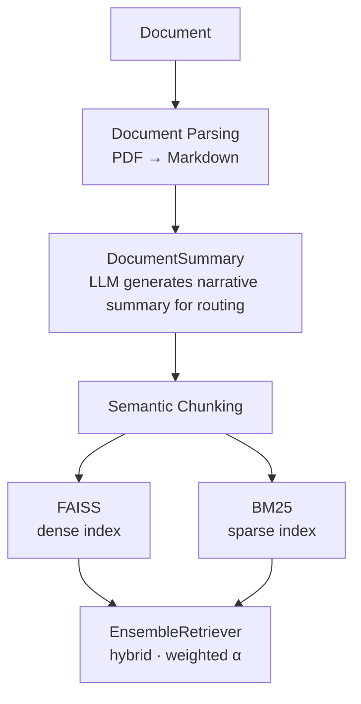

# ManuIndex

> Part of the **GRAG** (Granular Retrieval-Augmented Generation) research project.

ManuIndex ingests documents, builds both a dense FAISS vector store and a sparse BM25 lexical index, and exposes three retrieval strategies — **dense (MMR)**, **sparse (BM25)**, and **hybrid** — all backed by quantized ONNX embedding models that run fully on CPU with no cloud dependency. It is based on **Granular Retrieval-Augmented Generation (GRAG)** is a novel RAG architecture designed to solve the **document zoo problem** — the fundamental retrieval bottleneck where multiple documents are mixed in a single vector database collection. 

### The Problem

In traditional RAG, all document chunks live in one collection. At query time, the retriever must scan through chunks from every ingested document, regardless of relevance. This causes:

- **Cross-document interference** — semantically similar chunks from the wrong document outrank the right ones
- **Wasted compute** — irrelevant chunks consume retrieval budget and LLM context tokens
- **Hallucination risk** — wrong-document retrievals ground the LLM in incorrect evidence

### The GRAG Solution

GRAG separates **document identity** from **content retrieval** via a two-level architecture:

1. **Document level** — each document gets a short LLM-generated summary. The summary is embedded and stored with a unique ID in a metadata file. At query time, the query embedding is compared against all summary embeddings to identify the single most relevant document (query routing).

2. **Chunk level** — only the chunks of the selected document are searched, using a hybrid dense + sparse retrieval strategy.

This means the retriever never mixes chunks across documents, eliminating cross-document noise entirely.

---

## Architecture Overview



---

## Components

### 1. `ONNXEmbedder` — `manu_index/src/inference.py`

A LangChain-compatible `Embeddings` implementation that runs quantized ONNX models locally via **ONNX Runtime** on CPU. Supports batched encoding, mean-pooling over the sequence dimension, and optional L2 normalisation.

---

### 2. `DocumentSummary` — `manu_index/src/summary.py`

Calls an OpenAI-compatible LLM to produce a **short, narrative summary** of a document. When section headings are present the prompt is built from headings only (reducing token cost); otherwise the raw text is used. The summary embedding acts as a **routing vector** — at query time ManuIndex picks the FAISS index whose summary vector is closest to the query.

---

### 3. `ManuIndex` — `manu_index/src/manu_index.py`

The main class. Persists everything under `persist_directory/`:

```
persist_directory/
├── _meta.json          ← doc summaries + L2-normalised summary embeddings
├── <doc_id>.faiss      ← FAISS flat index
├── <doc_id>.pkl        ← FAISS metadata
└── <doc_id>_tsr.pkl    ← serialised BM25Retriever
```

#### Public API

```python
ManuIndex(embeddings, client, persist_directory="manu_index_data")

.add_document(documents, chunk_size=100, chunk_overlap=0, threshold=0.7) → FAISS
.search(query, top_k=3, lambda_mult=0.5, alpha=0.5, search_strategy=None) → List[str]
.info()    → List[{"doc_id": str, "summary": str}]
.delete(doc_id)
.clear()
```

---

## Document Parser — `tests/parser.py`

Converts PDF files to clean Markdown using [**pymupdf4llm-tsr**](https://github.com/iam-tsr/pymupdf4llm/tree/feat/image_analyzer) (modified version of `pymypdf4llm`), with optional **vision-based image analysis** to transcribe figures, charts, and tables embedded in the PDF.

```python
pymupdf4llm.to_markdown(document, analyze_image=GroqImageAnalyzer(...))
```

The resulting `.md` file is then fed directly to `ManuIndex.add_document()`.

---

## Mathematics

### Semantic Chunking

Given input sentences $S = [s_1, s_2, \dots, s_n]$ encoded to vectors:

$$E = \text{Encode}(S) = [\mathbf{e}_1, \mathbf{e}_2, \dots, \mathbf{e}_n], \quad \mathbf{e}_i \in \mathbb{R}^d$$

Cosine similarity between adjacent embeddings:

$$\text{sim}(i) = \cos(\mathbf{e}_{i-1},\, \mathbf{e}_i) = \frac{\mathbf{e}_{i-1} \cdot \mathbf{e}_i}{\|\mathbf{e}_{i-1}\|\,\|\mathbf{e}_i\|}$$

A new chunk boundary is inserted at position $i$ when similarity falls below threshold $T \in [0,1]$:

$$B = \bigl\{i \in \{2,\dots,n\} \mid \text{sim}(i) < T\bigr\}$$

The final chunks $C = [c_1, c_2, \dots, c_k]$ are contiguous sub-sequences of $S$ split at $B$:

$$c_j = \bigoplus_{i=b_{j-1}}^{b_j - 1} s_i$$

where $b_0 = 1$, $b_k = n+1$, $\{b_1, \dots, b_{k-1}\} = B$, and $\bigoplus$ denotes string concatenation. In compact form:

$$C = \text{Split}\!\left(S,\ \Bigl\{i \in \{2,\dots,n\} \;\Big|\; \frac{\mathbf{e}_{i-1}\cdot\mathbf{e}_i}{\|\mathbf{e}_{i-1}\|\,\|\mathbf{e}_i\|} < T\Bigr\}\right)$$

---

### Dense Retrieval — Maximal Marginal Relevance (MMR)

MMR balances **relevance** to the query against **diversity** among selected results. Given a query embedding $\mathbf{q}$ and a candidate set $\mathcal{D}$, let $\mathcal{R}$ be the set of already-selected documents. At each step, MMR selects:

$$d^* = \underset{d_i \in \mathcal{D} \setminus \mathcal{R}}{\arg\max} \Bigl[\lambda \cdot \cos(\mathbf{e}_i, \mathbf{q}) - (1 - \lambda) \cdot \max_{d_j \in \mathcal{R}} \cos(\mathbf{e}_i, \mathbf{e}_j)\Bigr]$$

where:
- $\lambda \in [0, 1]$ (`lambda_mult`) controls the relevance–diversity trade-off
- $\lambda = 1$ → pure similarity ranking (no diversity)
- $\lambda = 0$ → maximum diversity (relevance ignored)
- $\cos(\mathbf{e}_i, \mathbf{q})$ is the relevance of candidate $d_i$ to the query
- $\max_{d_j \in \mathcal{R}} \cos(\mathbf{e}_i, \mathbf{e}_j)$ is the redundancy of $d_i$ w.r.t. already-selected results

This is repeated $k$ times to produce the final top-$k$ results.

---

### Sparse Retrieval — BM25

BM25 (Best Match 25) ranks documents by term-frequency saturation and document-length normalisation. For a query $Q = \{q_1, \dots, q_m\}$ and document $d$:

$$\text{BM25}(d, Q) = \sum_{i=1}^{m} \text{IDF}(q_i) \cdot \frac{f(q_i, d) \cdot (k_1 + 1)}{f(q_i, d) + k_1 \cdot \left(1 - b + b \cdot \dfrac{|d|}{\text{avgdl}}\right)}$$

where:

$$\text{IDF}(q_i) = \ln\!\left(\frac{N - n(q_i) + 0.5}{n(q_i) + 0.5} + 1\right)$$

| Symbol | Meaning |
|---|---|
| $f(q_i, d)$ | Term frequency of $q_i$ in document $d$ |
| $\|d\|$ | Length of document $d$ (in tokens) |
| $\text{avgdl}$ | Average document length across the corpus |
| $N$ | Total number of documents |
| $n(q_i)$ | Number of documents containing $q_i$ |
| $k_1$ | Term-frequency saturation parameter (default 1.5) |
| $b$ | Length normalisation parameter (default 0.75) |

BM25 excels at **exact keyword matching** and is complementary to dense retrieval, which handles **semantic paraphrase**.

---

### Hybrid Retrieval

ManuIndex fuses dense and sparse scores via a **weighted Reciprocal Rank Fusion** ensemble (LangChain `EnsembleRetriever`). The weight $\alpha$ controls the balance:

$$\text{score}_{\text{hybrid}}(d) = \alpha \cdot \text{score}_{\text{dense}}(d) + (1 - \alpha) \cdot \text{score}_{\text{sparse}}(d)$$

where:
- $\alpha \to 1$ → dense-only (semantic, MMR-ranked)
- $\alpha \to 0$ → sparse-only (lexical, BM25-ranked)
- $\alpha = 0.5$ → equal weight (default)

---

### Query Routing

At search time ManuIndex must identify which persisted FAISS index to load (one per document). It does this by comparing the **L2-normalised** query embedding against all stored summary embeddings using a dot product (equivalent to cosine similarity after normalisation):

$$\text{doc}^* = \underset{j}{\arg\max} \; \hat{\mathbf{q}} \cdot \hat{\mathbf{s}}_j$$

where $\hat{\mathbf{v}} = \mathbf{v} / \|\mathbf{v}\|$ and $\hat{\mathbf{s}}_j$ is the normalised summary embedding for document $j$.

---

## Quick Start

### Installation

```bash
# requires Python >= 3.11
uv sync
```

### Ingest a Document

```python
from openai import OpenAI
from manu_index import ONNXEmbedder, ManuIndex

embeddings = ONNXEmbedder(
    model="onnx_models/embeddinggemma_300m/onnx/model_q4.onnx",
    tokenizer="onnx_models/embeddinggemma_300m",
    max_length=768,
)

client = OpenAI(api_key="...", base_url="...")
db = ManuIndex(embeddings=embeddings, client=client)

db.add_document("path/to/document.md", threshold=0.7)
```

### Search

```python
# Hybrid (default)
results = db.search("What is the recommended daily protein intake?", top_k=3, alpha=0.5)

# Dense only — MMR with high diversity
results = db.search(query, top_k=3, lambda_mult=0.3, search_strategy="dense")

# Sparse only — BM25 exact keyword match
results = db.search(query, search_strategy="sparse")
```

### Parse a PDF First

```python
import pymupdf, pymupdf4llm
from pymupdf4llm.helpers.image_analyzer import GroqImageAnalyzer

analyzer = GroqImageAnalyzer(api_key="...", model_name="meta-llama/llama-4-scout-17b-16e")

with pymupdf.open("report.pdf") as doc:
    md = pymupdf4llm.to_markdown(doc, analyze_image=analyzer)

with open("report_parsed.md", "w") as f:
    f.write(md)

db.add_document("report_parsed.md")
```

### Index Management

```python
# List indexed documents with their summaries
for entry in db.info():
    print(entry["doc_id"], entry["summary"][:80])

# Remove a single document
db.delete("a3f91c")

# Wipe everything
db.clear()
```

---

<div style="text-align:center">
made with passion by TSR ;)
</div>