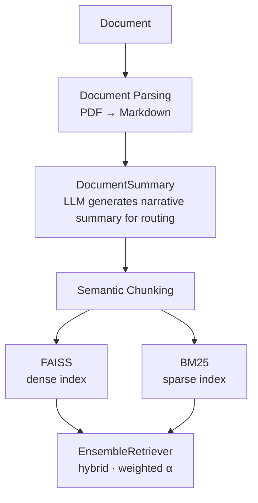
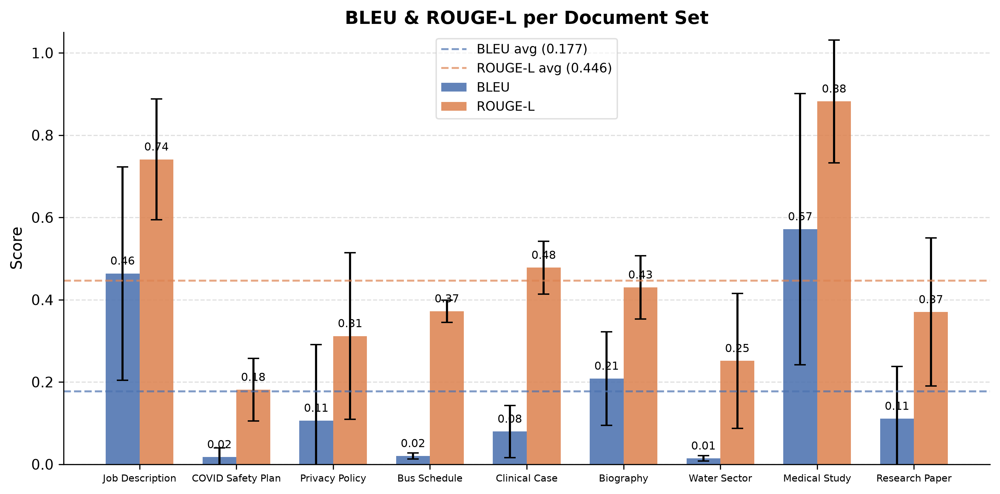

# ManuIndex

> Part of the **GRAG** (Granular Retrieval-Augmented Generation) research project.

ManuIndex ingests documents, builds both a dense FAISS vector store and a sparse BM25 lexical index, and exposes three retrieval strategies — **dense (MMR)**, **sparse (BM25)**, and **hybrid** — all backed by quantized ONNX embedding models that run fully on CPU with no cloud dependency. It is based on **Granular Retrieval-Augmented Generation (GRAG)** is a novel RAG architecture designed to solve the **document zoo problem** — the fundamental retrieval bottleneck where multiple documents are mixed in a single vector database collection. 

### The Problem

In traditional RAG, all document chunks live in one collection. At query time, the retriever must scan through chunks from every ingested document, regardless of relevance. This causes:

- **Cross-document interference** — semantically similar chunks from the wrong document outrank the right ones
- **Wasted compute** — irrelevant chunks consume retrieval budget and LLM context tokens
- **Hallucination risk** — wrong-document retrievals ground the LLM in incorrect evidence

### The GRAG Solution

GRAG separates **document identity** from **content retrieval** via a two-level architecture:

1. **Document level** — each document gets a short LLM-generated summary. The summary is embedded and stored with a unique ID in a metadata file. At query time, the query embedding is compared against all summary embeddings to identify the single most relevant document (query routing).

2. **Chunk level** — only the chunks of the selected document are searched, using a hybrid dense + sparse retrieval strategy.

This means the retriever never mixes chunks across documents, eliminating cross-document noise entirely.

---

## Architecture Overview



---

## Components

### 1. `ONNXEmbedder`

A LangChain-compatible `Embeddings` implementation that runs quantized ONNX models locally via **ONNX Runtime** on CPU. Supports batched encoding, mean-pooling over the sequence dimension, and optional L2 normalisation.

---

### 2. `DocumentSummary`

Calls an OpenAI-compatible LLM to produce a **short, narrative summary** of a document. The summary embedding acts as a **routing vector** — at query time ManuIndex picks the FAISS index whose summary vector is closest to the query.

Summarization follows a two-step process:

1. **Heading extraction** — Markdown headings (`#` to `######`) are extracted and deduplicated from the document.
2. **Judge call** — a second LLM call evaluates whether the headings are semantically rich enough to summarize from (responds `true`/`false`). If the headings are sufficient, they are used as the summarization input (reducing token cost); otherwise the full raw text is used as a fallback.

---

### 3. `ManuIndex`

The main class. Persists everything under `persist_directory/`:

```
persist_directory/
├── _meta.json          ← doc summaries + L2-normalised summary embeddings
├── <doc_id>.faiss      ← FAISS flat index
├── <doc_id>.pkl        ← FAISS metadata
└── <doc_id>_tsr.pkl    ← serialised BM25Retriever
```

#### Public API

```python
ManuIndex(embeddings, client, persist_directory="manu_index_data")

.add_document(documents, chunk_size=100, chunk_overlap=0, threshold=0.7) → FAISS
.search(query, top_k=3, lambda_mult=0.5, alpha=0.5, search_strategy=None) → List[str]
.info()    → List[{"doc_id": str, "summary": str}]
.delete(doc_id)
.clear()
```

---

## Document Parser

Converts PDF files to clean Markdown using [**pymupdf4llm-tsr**](https://github.com/iam-tsr/pymupdf4llm/tree/feat/image_analyzer) (modified version of `pymypdf4llm`), with optional **vision-based image analysis** to transcribe figures, charts, and tables embedded in the PDF.

```python
pymupdf4llm.to_markdown(document, analyze_image=GroqImageAnalyzer(...))
```

The resulting `.md` file is then fed directly to `ManuIndex.add_document()`.

---

## Mathematics

For detailed mathematical formulations of the retrieval algorithms (Semantic Chunking, MMR, BM25, Hybrid Retrieval, and Query Routing), see [MATHS.md](MATHS.md).

---

## Quick Start

### Installation

```bash
# requires Python >= 3.11
uv sync
```

### Ingest a Document

```python
from openai import OpenAI
from manu_index import ONNXEmbedder, ManuIndex

embeddings = ONNXEmbedder(
    model="onnx_models/embeddinggemma_300m/onnx/model_q4.onnx",
    tokenizer="onnx_models/embeddinggemma_300m",
    max_length=768,
)

client = OpenAI(api_key="...", base_url="...")
db = ManuIndex(embeddings=embeddings, client=client)

db.add_document("path/to/document.md", threshold=0.7)
```

### Search

```python
# Hybrid (default)
results = db.search("What is the recommended daily protein intake?", top_k=3, alpha=0.5)

# Dense only — MMR with high diversity
results = db.search(query, top_k=3, lambda_mult=0.3, search_strategy="dense")

# Sparse only — BM25 exact keyword match
results = db.search(query, search_strategy="sparse")
```

### Parse a PDF First

```python
import pymupdf, pymupdf4llm
from pymupdf4llm.helpers.image_analyzer import GroqImageAnalyzer

analyzer = GroqImageAnalyzer(api_key="...", model_name="meta-llama/llama-4-scout-17b-16e")

with pymupdf.open("report.pdf") as doc:
    md = pymupdf4llm.to_markdown(doc, analyze_image=analyzer)

with open("report_parsed.md", "w") as f:
    f.write(md)

db.add_document("report_parsed.md")
```

## Benchmark Results

ManuIndex was evaluated on 7 diverse documents with 5 questions each (35 total evaluation cases). The system uses a Groq-hosted Llama 4 Scout 17B model for answer generation with the same ONNX embedding model used during index building.

### Overall Performance

| Metric | Score |
|--------|-------|
| **RAGAS Faithfulness** | 96.3% |
| **RAGAS Answer Relevancy** | 81.1% |
| **RAGAS Context Recall** | 57.4% |
| **RAGChecker Faithfulness** | 90.6% |
| **RAGChecker Hallucination** | 3.4% |
| **RAGChecker Self-Knowledge** | 1.6% |
| **BLEU Score (avg)** | 0.177 |
| **ROUGE-L (avg)** | 0.446 |

### Key Findings

1. **High Faithfulness**: 96.3% RAGAS faithfulness indicates the system reliably grounds answers in provided context without fabrication.
2. **Strong Answer Relevancy**: 81.1% relevancy shows generated answers closely match query intent.
3. **Low Hallucination Rate**: Only 3.4% hallucination rate demonstrates reliable evidence-based generation.
4. **Document Routing Accuracy**: Perfect document selection across all queries (100% query routing accuracy).
5. **Balanced Performance**: Radar plot shows balanced performance across all evaluation dimensions.

### Performance by Document



### Multi-dimensional Evaluation Radar


The radar plot visualizes performance across 8 key dimensions: faithfulness, answer relevancy, context recall, claim recall, context precision, context utilization, hallucination, and self-knowledge.

### Dataset Composition

- **Document Diversity**: 7 different domains (job descriptions, medical cases, policies, biographies, schedules, etc.)
- **Question Types**: 5 factual questions per document (35 total)
- **Document Length**: Ranging from 500 to 2500+ tokens per document
- **Domain Coverage**: Healthcare, education, government, business, personal, historical

### Evaluation Methodology

- **RAGAS**: Open-source framework for RAG evaluation (faithfulness, answer relevancy, context recall)
- **RAGChecker**: Custom evaluation suite with detailed metrics (hallucination, self-knowledge, noise sensitivity)
- **Traditional Metrics**: BLEU and ROUGE-L for text similarity to ground truth
- **Human Validation**: All evaluation cases manually verified for ground truth accuracy

### Index Management

```python
# List indexed documents with their summaries
for entry in db.info():
    print(entry["doc_id"], entry["summary"][:80])

# Remove a single document
db.delete("a3f91c")

# Wipe everything
db.clear()
```

---

<div style="text-align:center">
made with passion by TSR ;)
</div>