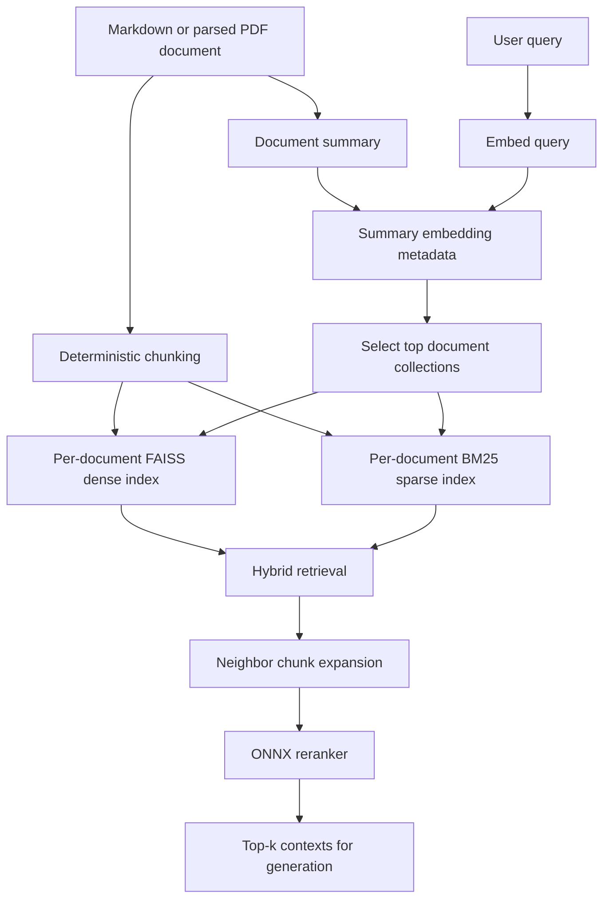

# ManuIndex - core implementation for the GRAG (Granular Retrieval-Augmented Generation) research paper

ManuIndex is a document-aware retrieval engine for the "document zoo" problem in RAG: real corpora contain many heterogeneous documents, but flat vector databases mix all chunks into one retrieval space. ManuIndex separates document routing from chunk retrieval so a query first selects the most relevant document collections, then searches only inside those collections with hybrid dense/sparse retrieval and reranking.

The goal of this repository is not to make prompts larger. It is to improve retrieval structure so the generator receives fewer, better, more local pieces of evidence.

## Research Motivation

Traditional RAG commonly stores chunks from every document in one vector index. This makes retrieval fragile when the corpus contains reports, policies, meeting minutes, legal agreements, schedules, clinical notes, press releases, and other formats at the same time.

The main failure modes are:

- Cross-document interference: a semantically similar chunk from the wrong document can outrank the right evidence.
- Lost local context: a single chunk may match the query but miss neighboring clauses, table rows, conditions, or definitions.
- Wasted context budget: irrelevant chunks consume the top-k window and the LLM prompt.
- Hallucination pressure: weak or wrong evidence forces the generator to infer beyond the retrieved context.

GRAG addresses this by making retrieval granular at two levels:

1. Document-level routing: each ingested document receives a compact LLM-generated summary. The summary is embedded and stored as the routing vector for that document.
2. Chunk-level retrieval: selected document collections are searched internally with dense MMR, sparse BM25, neighbor expansion, and ONNX reranking.

## System Overview



At search time, ManuIndex loads only the selected per-document collections instead of searching a single mixed index over every chunk in the corpus.

## Core Components

### ManuIndex

`ManuIndex` is the main retrieval class. It persists one dense FAISS index and one BM25 sparse index per document, plus a metadata file containing document summaries and summary embeddings.

Current constructor:

```python
from manu_index import ManuIndex

index = ManuIndex(
    client=client,
    model_name="your-openai-compatible-model",
    embeddings=embeddings,
    persist_directory="manu_index_db",
)
```

Main methods:

```python
index.add_document(documents, chunk_size=500)
index.search(query, reranker, top_k=3, top_c=5, lambda_mult=0.8, alpha=0.5)
index.info()
index.delete(doc_id)
index.clear()
```

Retrieval stages in `search()`:

1. Embed the user query.
2. Compare the query embedding against stored summary embeddings.
3. Select the top `top_c` document collections.
4. Run hybrid retrieval inside each selected collection.
5. Expand retrieved chunks with immediate neighbors.
6. Deduplicate candidate text.
7. Rerank candidates with an ONNX reranker.
8. Return the final top-k passage strings.

### ONNXEmbedder

`ONNXEmbedder` is a LangChain-compatible embedding wrapper around ONNX Runtime. It supports:

- CPU and CUDA execution providers.
- Hugging Face tokenizers.
- Batched inference.
- Mean pooling for sequence outputs.
- Optional L2 normalization.
- `embed_documents()` and `embed_query()` methods for LangChain integrations.

Example:

```python
from manu_index import ONNXEmbedder

embeddings = ONNXEmbedder(
    model="onnx_models/bge_m3/onnx/model_q4.onnx",
    tokenizer="onnx_models/bge_m3",
    max_length=1024,
    device="cpu",
)
```

### ONNXReranker

`ONNXReranker` scores query-document pairs with ONNX Runtime and returns documents sorted by relevance. It supports:

- BGE sequence-classification rerankers such as `bge-reranker-v2-m3`.
- Qwen decoder-style rerankers.
- BGE decoder-style rerankers.
- Automatic reranker type inference from local config when possible.
- CPU or CUDA execution.

Example:

```python
from manu_index import ONNXReranker

reranker = ONNXReranker(
    model="onnx_models/bge_reranker_v2_m3/onnx/model_q4.onnx",
    tokenizer="onnx_models/bge_reranker_v2_m3",
    max_length=1024,
    device="cuda",
    reranker_type="auto",
)
```

### DocumentSummary

`DocumentSummary` creates a compact routing summary for each document. It first extracts Markdown headings and asks an LLM judge whether those headings are semantically sufficient. If the headings are rich enough, only the headings are summarized; otherwise the full document text is summarized.

This reduces summary-generation token cost when a document has good structure while preserving fallback quality for sparse or unstructured documents.

### Persistence Format

By default, indexes are stored under `manu_index_db/`.

```text
manu_index_db/
  _meta.json             Document IDs, summaries, and summary embeddings
  <doc_id>dnse.faiss     Per-document FAISS dense index
  <doc_id>dnse.pkl       Per-document FAISS docstore metadata
  <doc_id>spr.pkl        Per-document BM25 retriever pickle
```

The `doc_id` is a six-character UUID prefix generated when a document is added.

## Installation

This project uses `uv` and requires Python 3.11 or newer.

```bash
uv sync
```

Main runtime dependencies include FAISS CPU, LangChain community/text splitters, OpenAI-compatible client support, ONNX Runtime via Optimum, Transformers, Rank-BM25, Pillow, and `pymupdf4llm-tsr`.

## Model Setup

The benchmark configuration uses:

- Embedding model: BGE-M3 ONNX Q4
- Reranker model: BGE reranker v2 M3 ONNX Q4
- Generator/evaluator endpoint: OpenAI-compatible chat API

Download helper:

```bash
python helpers/model_download.py
```

The helper currently downloads the configured embedding model into `onnx_models/`. To download reranker models as well, call `download_onnx_models("reranker", "onnx_models")` from `helpers/model_download.py` or extend the script entry point.

## Quick Start

### Build an index

```python
import os
from openai import OpenAI
from manu_index import ManuIndex, ONNXEmbedder, ONNXReranker

client = OpenAI(
    api_key=os.environ["OPENAI_API_KEY"],
    base_url=os.environ.get("OPENAI_BASE_URL"),
)
model_name = os.environ["OPENAI_MODEL_NAME"]

embeddings = ONNXEmbedder(
    model="onnx_models/bge_m3/onnx/model_q4.onnx",
    tokenizer="onnx_models/bge_m3",
    max_length=1024,
    device="cpu",
)

reranker = ONNXReranker(
    model="onnx_models/bge_reranker_v2_m3/onnx/model_q4.onnx",
    tokenizer="onnx_models/bge_reranker_v2_m3",
    max_length=1024,
    device="cuda",
    reranker_type="bge_classifier",
)

index = ManuIndex(
    client=client,
    model_name=model_name,
    embeddings=embeddings,
    persist_directory="manu_index_db",
)

index.add_document("your_markdown_file")
```

### Search

```python
contexts = index.search(
    query="What role is being hired for?",
    reranker=reranker,
    top_k=3,
    top_c=5,
    alpha=0.5,
    lambda_mult=0.8,
)

for context in contexts:
    print(context)
```

Parameter meanings:

- `top_k`: number of final passages returned after reranking.
- `top_c`: number of document collections selected by summary routing.
- `alpha`: hybrid retrieval weight; `1.0` favors dense retrieval and `0.0` favors sparse retrieval.
- `lambda_mult`: MMR relevance-diversity tradeoff; higher values favor relevance.

### Inspect and manage indexed documents

```python
for entry in index.info():
    print(entry["doc_id"], entry["summary"])

index.delete("abc123")
index.clear()
```

## PDF Parsing Helper

`helpers/parser.py` converts PDFs to Markdown using `pymupdf4llm-tsr` and optionally sends figures/images to a Groq-hosted vision model for analysis.

Conceptual flow:

```python
import pymupdf
import pymupdf4llm
from pymupdf4llm.helpers.image_analyzer import GroqImageAnalyzer

analyzer = GroqImageAnalyzer(api_key="...", model_name="meta-llama/llama-4-scout-17b-16e-instruct")

with pymupdf.open("report.pdf") as document:
    markdown = pymupdf4llm.to_markdown(document, analyze_image=analyzer)

index.add_document(markdown)
```

This is useful for document-zoo corpora where important evidence may be embedded in figures, charts, scanned-like layouts, or tables.

## Benchmark

The benchmark compares GRAG/ManuIndex against a Naive RAG baseline on the same source documents, questions, embeddings, chunk size, top-k, generator, and RAGAS evaluation setup.

Shared benchmark configuration from the saved reports:

| Setting | Value |
| --- | --- |
| Documents | 25 |
| Questions | 125 |
| Top-k | 3 |
| Chunk size | 500 |
| Embedding model | BGE-M3 ONNX Q4 |
| Generator | Gemma-4-E2B GGUF Q4 |
| Metrics | RAGAS faithfulness, answer relevancy, context precision, context recall, answer correctness |

Aggregate saved results:

| Metric | GRAG / ManuIndex | Naive RAG | Absolute gain | Relative gain |
| --- | ---: | ---: | ---: | ---: |
| Faithfulness | 0.9799 | 0.9408 | +0.0391 | +4.15% |
| Answer relevancy | 0.8332 | 0.7993 | +0.0339 | +4.24% |
| Context precision | 0.8547 | 0.8240 | +0.0307 | +3.72% |
| Context recall | 0.9205 | 0.8204 | +0.1001 | +12.20% |
| Answer correctness | 0.6872 | 0.6374 | +0.0498 | +7.81% |

Main interpretation:

- GRAG improves every reported metric over the flat baseline.
- The largest gain is context recall, which directly supports the project hypothesis that document-aware retrieval reduces missing-evidence failures.
- Context precision also improves, suggesting the recall gain is not simply caused by adding more noisy text.
- The answer correctness and answer relevancy gains indicate that retrieval improvements carry through to generation quality.

See `benchmark/README.md` for the fuller benchmark analysis.

Reliability note: these benchmark numbers are useful for comparing retrieval behavior under a shared setup, but they should be treated as directional rather than final research claims, since the generator and model-based evaluator are small/local-model oriented.

## Mathematical Notes

[`MATHS.md`](https://github.com/iam-tsr/ManuIndex/blob/main/MATHS.md) documents the mathematical formulation of:

- Semantic chunking notes from the earlier design.
- Dense retrieval with Maximal Marginal Relevance.
- Sparse retrieval with BM25.
- Hybrid retrieval.
- Query routing through summary embeddings.

The current implementation uses deterministic recursive chunking in `ManuIndex.add_document()`. The older semantic chunking method remains in the source as deprecated and raises `NotImplementedError`.

## Why This Repository Matters for the Research

This repository is the implementation core for GRAG. It contains the retrieval mechanism, persistence design, local ONNX inference wrappers, benchmark dataset, baseline comparison, and saved evaluation reports needed to support the research argument:

A RAG system can become more reliable on heterogeneous document collections by improving retrieval granularity and routing structure, rather than relying only on longer prompts or larger generation models.

## License

ManuIndex is licensed under MIT. See the [LICENSE](https://github.com/iam-tsr/ManuIndex/blob/main/LICENSE) file for details.

---

<div style="text-align:center">
made with passion by TSR ;)
</div>
