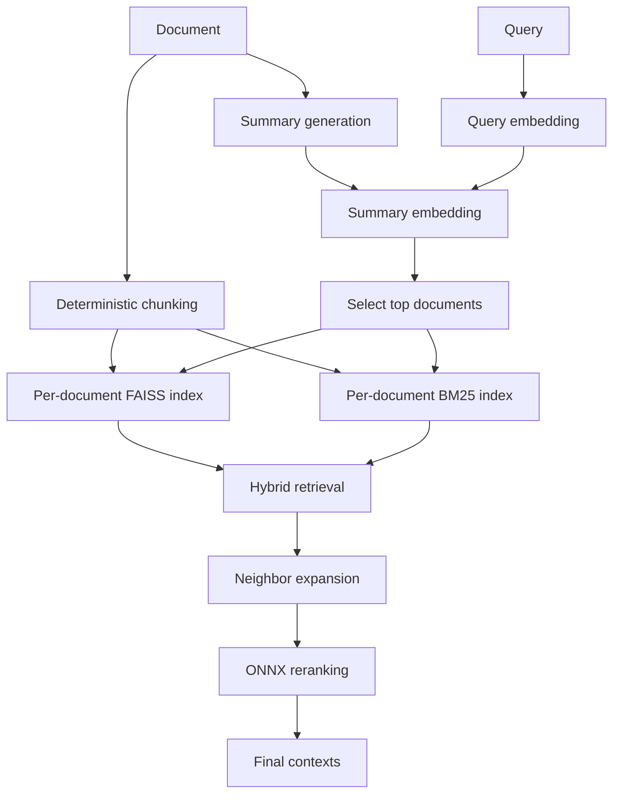

<div align="center">

<p>Core implementation of **GRAG**: a document-aware retrieval pipeline built for heterogeneous RAG corpora.</p>

<br>


</div>

ManuIndex is designed for the "document zoo" problem: policies, reports, minutes, contracts, research notes, schedules, and other formats often behave poorly when everything is dumped into one flat vector index.

Instead of retrieving chunks from one mixed search space, ManuIndex routes the query to the most relevant documents first, then runs hybrid retrieval inside those selected documents only.

## Why It Works

- **Document routing first**: each document gets a compact LLM summary used as a routing vector.
- **Local retrieval second**: dense FAISS and sparse BM25 retrieval run inside selected documents.
- **Better context locality**: neighbor chunk expansion preserves nearby evidence.
- **Cleaner final ranking**: ONNX reranking filters noisy candidates before generation.
- **Practical deployment**: embeddings and reranking can run locally with ONNX Runtime.

## Retrieval Flow



## Benchmark Snapshot

The suite compares **6 retrieval pipelines** (GRAG + 5 standard RAG variants) on **2 Hugging Face datasets**, **100 questions each**, with fixed `top_k=5` and a **2×2** matrix of ONNX embeddings × answer LLMs (BGE-M3 / Qwen3-Embedding 0.6B × Gemma-4-E2B / Qwen3.5-2B). Full tables, plots, and methodology live in [`benchmark/README.md`](benchmark/README.md).

Averages below are over all **8** embedding × LLM panels (**4** per dataset).

### Across both datasets

| Method | Avg F1 | Avg Context Recall | Avg Faithfulness | Avg E2E Time | Avg Tokens |
| --- | ---: | ---: | ---: | ---: | ---: |
| **GRAG** | **0.6432** | **0.7506** | **0.8449** | **0.757s** | 418 |
| Parent–Child RAG | 0.5193 | 0.6414 | 0.7411 | 0.888s | 267 |
| Flat Hybrid RAG | 0.5165 | 0.6502 | 0.7567 | 0.979s | 241 |
| Naive RAG | 0.4957 | 0.6375 | 0.7563 | 0.980s | 244 |
| Query Rewrite RAG | 0.4952 | 0.6363 | 0.7567 | 1.430s | 387 |
| Hierarchical RAG | 0.4786 | 0.6141 | 0.7511 | 1.186s | **235** |

### By dataset (GRAG vs best baseline)

| Dataset | GRAG F1 | Best baseline F1 | GRAG Context Recall | GRAG E2E |
| --- | ---: | ---: | ---: | ---: |
| [Neural Bridge](https://huggingface.co/datasets/neural-bridge/rag-dataset-12000) | **0.7492** | 0.6300 (Parent–Child) | **0.8228** | **0.636s** |
| [RAGMix](https://huggingface.co/datasets/iam-tsr/ragmix) | **0.5371** | 0.4320 (Flat Hybrid) | **0.6783** | **0.879s** |

Interpretation:

- **GRAG leads on F1 in every emb × LLM panel** on both datasets (8/8).
- On average GRAG improves F1 by **~12–24 points** over the strongest non-GRAG baseline while also offering the **lowest mean end-to-end latency**.
- Flat baselines use fewer tokens per answer, but **query rewrite spends almost as many tokens as GRAG** without matching quality.
- RAGMix is harder overall; GRAG’s relative margin and latency advantage are larger there.

## Installation

ManuIndex requires **Python 3.11+** and uses `uv`.

```bash
uv sync
```

Core dependencies include FAISS, LangChain community utilities, ONNX Runtime via Optimum, Transformers, Rank-BM25, and PDF-to-Markdown tooling.

## Model Setup

Download the default embedding model:

```bash
python helpers/model_download.py
```

If you also want the reranker weights, call `download_onnx_models("reranker", "onnx_models")` from the helper module.

## Environment

Set these variables before running the examples:

```bash
OPENAI_API_KEY=...
OPENAI_MODEL_NAME=...
OPENAI_BASE_URL=...
```

## Quick Start

```python
import os
from openai import OpenAI
from manu_index import ManuIndex, ONNXEmbedder, ONNXReranker

client = OpenAI(
    api_key=os.environ["OPENAI_API_KEY"],
    base_url=os.environ.get("OPENAI_BASE_URL"),
)

embeddings = ONNXEmbedder(
    model="onnx_models/bge_m3/onnx/model.onnx",
    tokenizer="onnx_models/bge_m3",
    max_length=1024,
    device="cpu", # or "cuda" if you have a GPU
)

# Optional reranker for final candidate filtering
reranker = ONNXReranker(
    model="onnx_models/bge_reranker_v2_m3/onnx/model.onnx",
    tokenizer="onnx_models/bge_reranker_v2_m3",
    max_length=1024,
    device="cpu", # or "cuda" if you have a GPU
    reranker_type="auto", # automatically detects reranker type (classifier or decoder)
)

index = ManuIndex(
    client=client,
    model_name=os.environ["OPENAI_MODEL_NAME"],
    embeddings=embeddings,
)

index.add_document("sample.md")

results = index.search(
    query="What role is being hired for?",
    reranker=reranker,
    top_k=3,
    top_c=5,
    alpha=0.5,
    lambda_mult=0.8,
)

for text in results:
    print(text)
```

## Public API

### `ManuIndex`

Main methods:

```python
index.add_document(documents, chunk_size=100)
index.search(query, top_k=3, top_c=5, lambda_mult=0.8, alpha=0.5)
index.info()
index.delete(doc_id)
index.clear()
```

Search behavior:

1. Embed the query.
2. Route it to the top document summaries.
3. Retrieve candidates with dense + sparse search.
4. Expand neighbor chunks.
5. Rerank the final candidate pool.

### `ONNXEmbedder`

LangChain-compatible embedding wrapper with:

- CPU and CUDA execution
- batched inference
- mean pooling
- optional normalization
- `embed_documents()` and `embed_query()`

### `ONNXReranker`

ONNX reranker supporting:

- BGE classifier rerankers
- BGE decoder rerankers
- Qwen decoder rerankers
- automatic reranker type inference
- CPU and CUDA execution

## PDF Ingestion

PDFs can be converted to Markdown before indexing, including optional image analysis for charts, figures, or visually rich pages.

```python
import pymupdf
import pymupdf4llm
from pymupdf4llm.helpers.image_analyzer import OpenAIImageAnalyzer

analyzer = OpenAIImageAnalyzer(
    api_key=os.getenv("OPENAI_API_KEY"),
    model_name=os.getenv("OPENAI_MODEL_NAME")
)

with pymupdf.open("report.pdf") as document:
    markdown = pymupdf4llm.to_markdown(document, analyze_image=analyzer)

index.add_document(markdown)
```

## Repository Highlights

- `manu_index`: core retrieval, embedding, reranking, and summary-routing logic
- `benchmark`: evaluation suite, saved reports, and comparison plots
- `helpers`: model download and PDF parsing utilities
- `tests`: usage examples for indexing, search, reranking, and summarization

## Notes

- Document summaries are generated with an LLM and stored as routing metadata.
- Each indexed document gets its own FAISS and BM25 stores rather than joining all chunks into one global index.
- [`MATHS.md`](https://github.com/iam-tsr/ManuIndex/blob/main/MATHS.md) contains the underlying retrieval formulations and scoring notes.

## License

MIT. See [`LICENSE`](https://github.com/iam-tsr/ManuIndex/blob/main/LICENSE).
