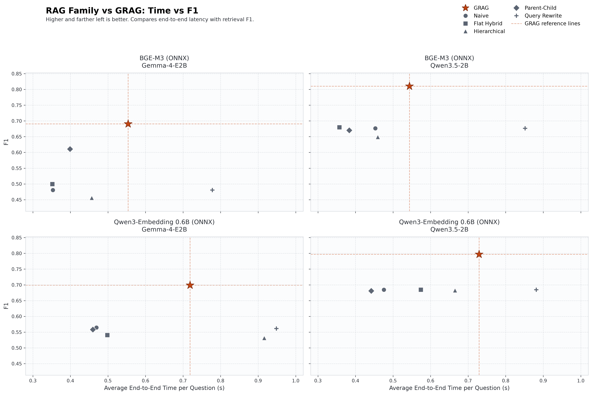
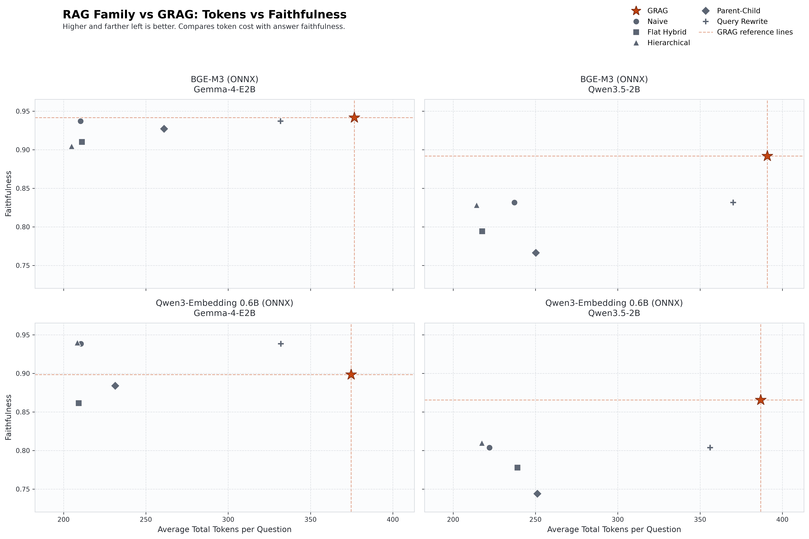
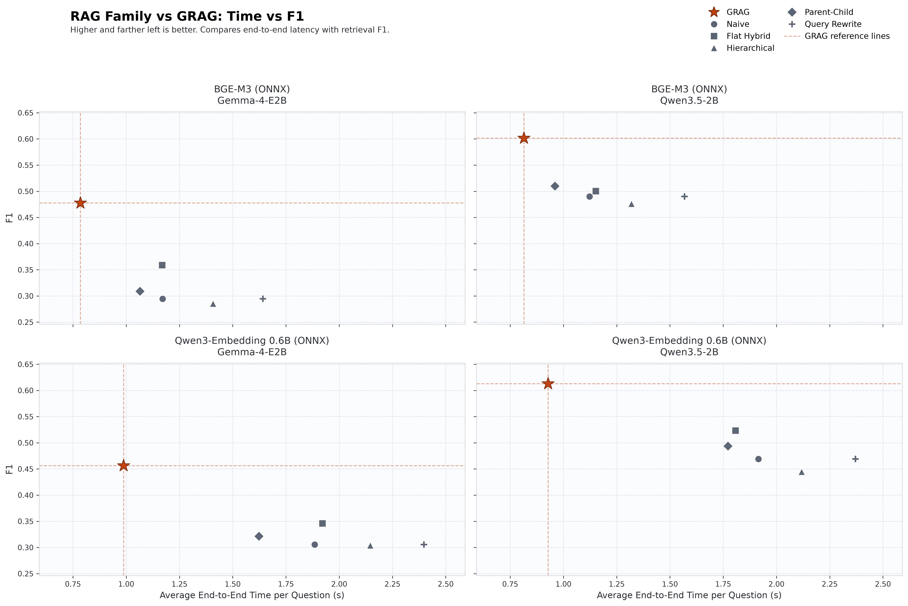
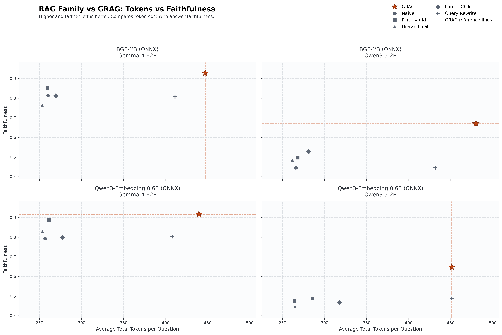

# GRAG Benchmark

This directory contains the **end-to-end evaluation suite** for [ManuIndex / GRAG](../README.md) against a family of standard RAG pipelines.

The goal is not only to measure answer quality, but to show the **quality–latency–cost trade-off**: whether document-aware routing (GRAG) improves retrieval F1 and faithfulness without becoming the most expensive system.

---

## Table of Contents

- [What We Measure](#what-we-measure)
- [Evaluation Setup](#evaluation-setup)
- [Methods Compared](#methods-compared)
- [Directory Layout](#directory-layout)
- [Results Overview](#results-overview)
  - [Neural Bridge (`rag-dataset-12000`)](#1-neural-bridge-rag-dataset-12000)
  - [RAGMix (`iam-tsr/ragmix`)](#2-ragmix-iam-tsrragmix)
- [How to Read the Plots](#how-to-read-the-plots)
- [Running the Benchmark](#running-the-benchmark)
- [Generating Plots](#generating-plots)
- [Report Format](#report-format)
- [Metrics Definitions](#metrics-definitions)
- [Reproducibility Notes](#reproducibility-notes)

---

## What We Measure

Each method is run on the same evaluation cases with the same embedding model and answer LLM. For every question we record:

| Axis | What it captures |
| --- | --- |
| **Quality (RAGAS)** | Faithfulness, answer relevancy, context precision/recall, answer correctness, and derived **F1** |
| **Runtime** | Average retrieval time and average answer-generation time per question |
| **Cost** | Average input / output / total tokens per question (including auxiliary LLM calls such as query rewrite) |

Plots then put these axes together:

- **Time vs F1** — efficiency frontier (higher and farther left is better)
- **Tokens vs Faithfulness** — cost of grounded answers (higher and farther left is better)

---

## Evaluation Setup

### Datasets

Two public Hugging Face evaluation sets are used. Each run loads the `test` split and evaluates the **first 100 cases** (one question per document/context).

| Aggregate report | Hugging Face dataset | Notes |
| --- | --- | --- |
| `neural_bridge_report.json` | [`neural-bridge/rag-dataset-12000`](https://huggingface.co/datasets/neural-bridge/rag-dataset-12000) | Classic single-document RAG QA pairs |
| `ragmix_report.json` | [`iam-tsr/ragmix`](https://huggingface.co/datasets/iam-tsr/ragmix) | More heterogeneous mix; generally harder for flat baselines |

Source documents are taken from the dataset row (`document` or `context`). Ground-truth answers come from the `answer` field.

### Fixed protocol

| Setting | Value |
| --- | --- |
| Cases per run | 100 (first rows of `test`) |
| `top_k` | 5 |
| `chunk_size` | 100 (with method-specific overlap / hierarchy where applicable) |
| Answer generation | OpenAI-compatible chat completion, `temperature=0`, `max_tokens=2048` |
| System prompt | Answer **only** from retrieved context; refuse if context is insufficient |
| Evaluation library | [RAGAS](https://github.com/explodinggradients/ragas) |

### Model matrix

Every method is evaluated on a **2 × 2** grid of embedding model × answer LLM:

| Embedding (ONNX) | Answer LLM |
| --- | --- |
| **BGE-M3** | **Gemma-4-E2B** |
| **BGE-M3** | **Qwen3.5-2B** |
| **Qwen3-Embedding 0.6B** | **Gemma-4-E2B** |
| **Qwen3-Embedding 0.6B** | **Qwen3.5-2B** |

Embeddings run locally via ONNX Runtime (typically GPU). The answer LLM is reached through `OPENAI_API_KEY` / `OPENAI_BASE_URL` / `OPENAI_MODEL_NAME`.

---

## Methods Compared

| Method | Idea |
| --- | --- |
| **GRAG (ManuIndex)** | Document-aware index: summary routing, per-document hybrid retrieval, neighbor expansion |
| **Naive RAG** | Flat chunking + dense FAISS similarity search |
| **Flat Hybrid RAG** | Dense (MMR) + BM25 ensemble over a single flat index |
| **Hierarchical RAG** | Retrieve sections first, then chunks inside selected sections |
| **Parent–Child RAG** | Match fine-grained children, return parent spans for context |
| **Query Rewrite RAG** | LLM rewrites the query, then dense retrieval (extra tokens + latency) |

Baseline implementations live in `scripts/src/`. GRAG uses the library entrypoint `manu_index.ManuIndex` (ingested into a temporary persist directory per run).

---

## Results Overview

Numbers below are taken from the checked-in aggregate reports. **F1** is the harmonic mean of context precision and context recall. **E2E** is average retrieval time + average answer time (seconds per question). **Toks** is average total tokens per question.

### 1. Neural Bridge (`rag-dataset-12000`)

On this set GRAG is consistently the **highest-F1** method across all four embedding × LLM panels, while remaining competitive on latency.

#### BGE-M3 + Gemma-4-E2B

| Method | F1 | Faithfulness | Context Recall | Context Precision | Answer Correctness | E2E (s) | Tokens |
| --- | ---: | ---: | ---: | ---: | ---: | ---: | ---: |
| **GRAG** | **0.6906** | **0.9417** | 0.8131 | **0.6003** | 0.6983 | 0.554 | 376.6 |
| Parent–Child | 0.6108 | 0.9272 | **0.8297** | 0.4832 | **0.6991** | **0.399** | 261.0 |
| Flat Hybrid | 0.4995 | 0.9100 | 0.6779 | 0.3955 | 0.6151 | 0.352 | 211.1 |
| Naive | 0.4806 | 0.9372 | 0.6785 | 0.3721 | 0.6267 | 0.353 | 210.3 |
| Query Rewrite | 0.4806 | 0.9372 | 0.6785 | 0.3721 | 0.6267 | 0.778 | 331.8 |
| Hierarchical | 0.4558 | 0.9047 | 0.6896 | 0.3404 | 0.6110 | 0.457 | **204.9** |

#### BGE-M3 + Qwen3.5-2B

| Method | F1 | Faithfulness | Context Recall | E2E (s) | Tokens |
| --- | ---: | ---: | ---: | ---: | ---: |
| **GRAG** | **0.8103** | **0.8918** | **0.8466** | 0.544 | 390.8 |
| Flat Hybrid | 0.6796 | 0.7942 | 0.7569 | **0.357** | 217.7 |
| Naive | 0.6765 | 0.8315 | 0.7835 | 0.453 | 237.2 |
| Query Rewrite | 0.6765 | 0.8315 | 0.7835 | 0.852 | 370.1 |
| Parent–Child | 0.6701 | 0.7663 | 0.7714 | 0.384 | 250.2 |
| Hierarchical | 0.6488 | 0.8283 | 0.7875 | 0.459 | **214.2** |

#### Qwen3-Embedding 0.6B + Gemma-4-E2B

| Method | F1 | Faithfulness | Context Recall | E2E (s) | Tokens |
| --- | ---: | ---: | ---: | ---: | ---: |
| **GRAG** | **0.6989** | 0.8986 | **0.7910** | 0.719 | 374.6 |
| Naive | 0.5646 | 0.9383 | 0.6988 | 0.469 | 210.5 |
| Query Rewrite | 0.5613 | 0.9383 | 0.6888 | 0.948 | 332.0 |
| Parent–Child | 0.5581 | 0.8840 | 0.6745 | **0.460** | 231.3 |
| Flat Hybrid | 0.5406 | 0.8614 | 0.6712 | 0.498 | 209.2 |
| Hierarchical | 0.5315 | **0.9400** | 0.6398 | 0.916 | **208.4** |

#### Qwen3-Embedding 0.6B + Qwen3.5-2B

| Method | F1 | Faithfulness | Context Recall | E2E (s) | Tokens |
| --- | ---: | ---: | ---: | ---: | ---: |
| **GRAG** | **0.7969** | **0.8655** | **0.8407** | 0.729 | 386.9 |
| Naive | 0.6845 | 0.8038 | 0.7749 | 0.476 | 222.1 |
| Query Rewrite | 0.6845 | 0.8038 | 0.7749 | 0.882 | 356.1 |
| Flat Hybrid | 0.6845 | 0.7778 | 0.7651 | 0.574 | 239.1 |
| Hierarchical | 0.6824 | 0.8099 | 0.7909 | 0.665 | **217.5** |
| Parent–Child | 0.6810 | 0.7440 | 0.7494 | **0.442** | 251.2 |

#### Neural Bridge plots

**Time vs F1** — GRAG (orange star) sits at the top of each panel; dashed lines mark GRAG’s reference F1 and latency.

**Tokens vs Faithfulness** — higher faithfulness at moderate token cost; query-rewrite pays extra tokens without matching GRAG quality.

---

### 2. RAGMix (`iam-tsr/ragmix`)

RAGMix is a harder, more heterogeneous mix. Absolute F1 is lower for every method, but **relative ranking is stable**: GRAG leads on F1 in every panel, and often wins on end-to-end latency as well (baselines rebuild flat indexes per query/document in this harness).

#### BGE-M3 + Gemma-4-E2B

| Method | F1 | Faithfulness | Context Recall | E2E (s) | Tokens |
| --- | ---: | ---: | ---: | ---: | ---: |
| **GRAG** | **0.4777** | **0.9278** | **0.6805** | **0.785** | 447.1 |
| Flat Hybrid | 0.3587 | 0.8511 | 0.5888 | 1.169 | 259.5 |
| Parent–Child | 0.3089 | 0.8130 | 0.4923 | 1.064 | 269.5 |
| Naive | 0.2945 | 0.8135 | 0.5227 | 1.171 | 260.1 |
| Query Rewrite | 0.2945 | 0.8067 | 0.5227 | 1.641 | 411.2 |
| Hierarchical | 0.2855 | 0.7642 | 0.4363 | 1.408 | **253.1** |

#### BGE-M3 + Qwen3.5-2B

| Method | F1 | Faithfulness | Context Recall | E2E (s) | Tokens |
| --- | ---: | ---: | ---: | ---: | ---: |
| **GRAG** | **0.6018** | **0.6698** | **0.6658** | **0.814** | 480.0 |
| Parent–Child | 0.5102 | 0.5272 | 0.5733 | 0.959 | 281.0 |
| Flat Hybrid | 0.5003 | 0.4972 | 0.6174 | 1.152 | 268.1 |
| Naive | 0.4901 | 0.4451 | 0.5608 | 1.123 | 265.9 |
| Query Rewrite | 0.4901 | 0.4451 | 0.5608 | 1.569 | 431.7 |
| Hierarchical | 0.4763 | 0.4852 | 0.5742 | 1.319 | **261.7** |

#### Qwen3-Embedding 0.6B + Gemma-4-E2B

| Method | F1 | Faithfulness | Context Recall | E2E (s) | Tokens |
| --- | ---: | ---: | ---: | ---: | ---: |
| **GRAG** | **0.4563** | **0.9165** | **0.6665** | **0.988** | 439.5 |
| Flat Hybrid | 0.3458 | 0.8865 | 0.5245 | 1.922 | 261.2 |
| Parent–Child | 0.3216 | 0.7988 | 0.4967 | 1.623 | 276.9 |
| Naive | 0.3055 | 0.7928 | 0.5285 | 1.885 | 256.6 |
| Query Rewrite | 0.3055 | 0.8028 | 0.5285 | 2.397 | 407.9 |
| Hierarchical | 0.3042 | 0.8300 | 0.4800 | 2.146 | **253.4** |

#### Qwen3-Embedding 0.6B + Qwen3.5-2B

| Method | F1 | Faithfulness | Context Recall | E2E (s) | Tokens |
| --- | ---: | ---: | ---: | ---: | ---: |
| **GRAG** | **0.6128** | **0.6477** | **0.7004** | **0.928** | 451.1 |
| Flat Hybrid | 0.5230 | 0.4755 | 0.6002 | 1.808 | 264.4 |
| Parent–Child | 0.4939 | 0.4679 | 0.5438 | 1.772 | 317.6 |
| Naive | 0.4689 | 0.4885 | 0.5525 | 1.915 | 285.6 |
| Query Rewrite | 0.4689 | 0.4885 | 0.5525 | 2.371 | 451.4 |
| Hierarchical | 0.4445 | 0.4465 | 0.5148 | 2.118 | **265.0** |

#### RAGMix plots

**Time vs F1** — GRAG dominates the upper-left region on every emb × LLM panel.

**Tokens vs Faithfulness** — GRAG preserves high faithfulness (especially with Gemma) while query rewrite spends similar tokens for weaker groundedness.

---

## Metrics Definitions

| Metric | Role |
| --- | --- |
| **Context Precision** | Fraction of retrieved contexts that are relevant to the question / reference |
| **Context Recall** | How completely the retrieved contexts cover the reference answer |
| **F1** | $(2 \cdot P \cdot R / (P + R))$ over context precision and context recall |
| **Faithfulness** | Whether the generated answer is supported by the retrieved contexts |
| **Answer Relevancy** | Whether the answer addresses the user question |
| **Answer Correctness** | Semantic agreement with the ground-truth answer |
| **E2E time** | `avg_retrieval_time + avg_answer_time` (seconds / question) |
| **Total tokens** | Prompt + completion tokens for answering, plus auxiliary calls (e.g. rewrites) |

RAGAS evaluation uses the same OpenAI-compatible LLM and the same ONNX embedder as the run (via LangChain wrappers).

---

## Reproducibility Notes

- **Same cases for all methods** within a dataset configuration (first 100 `test` rows).
- **Temperature 0** for answer generation to reduce variance.
- Baselines build retrieval indexes **per document/query** inside the harness; GRAG ingests all evaluation documents once into a temporary ManuIndex. Compare quality metrics and token cost directly; interpret absolute retrieval latency with that indexing difference in mind.
- Query-rewrite token usage includes rewrite calls (see `average_additional_tokens` / elevated output tokens).

---

## Takeaways

1. **GRAG leads on F1** on both Neural Bridge and RAGMix for every embedding × LLM pair in the checked-in results.
2. On **Neural Bridge**, simpler methods can be slightly faster or cheaper per question, but they lag on context precision/F1; Parent–Child is the strongest non-GRAG baseline on Gemma + BGE.
3. On **RAGMix**, GRAG often improves **both** F1 and end-to-end time relative to flat rebuild baselines, while keeping faithfulness high (especially with Gemma).
4. **Query rewrite** increases tokens and latency without closing the F1 gap to GRAG.
5. Use the **Time vs F1** and **Tokens vs Faithfulness** plots above for a compact multi-axis comparison when presenting results.
