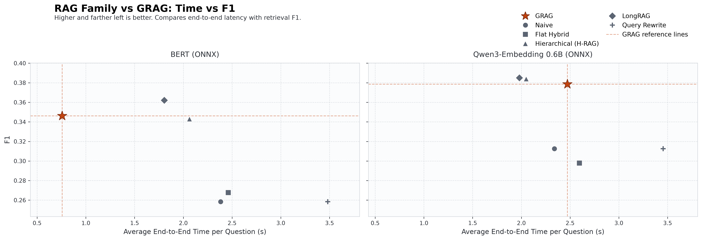
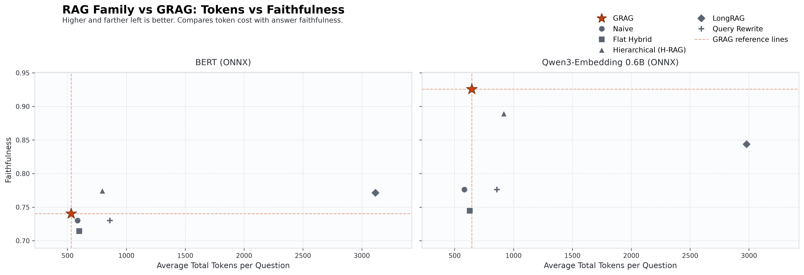
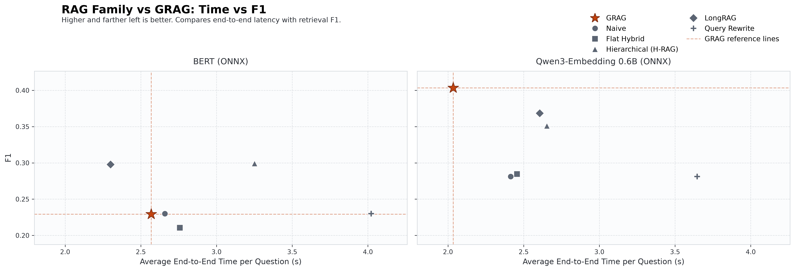
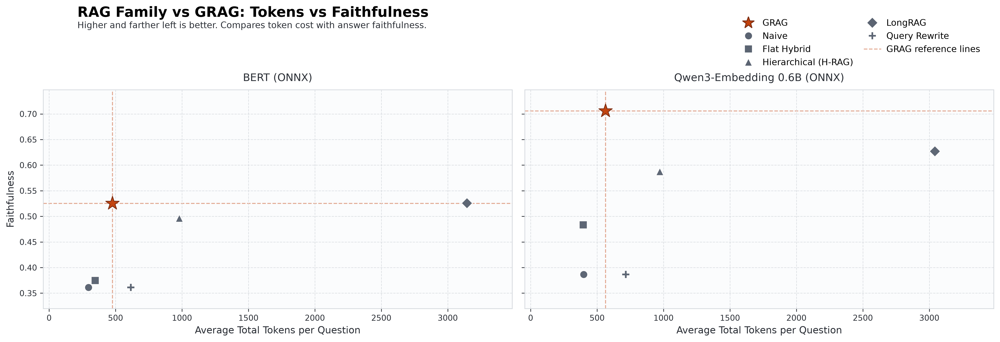

# GRAG Benchmark

This directory contains the **end-to-end evaluation suite** for [ManuIndex / GRAG](../README.md) against a family of standard RAG pipelines.

The goal is not only to measure answer quality, but to show the **quality-latency-cost trade-off**: whether document-aware routing (GRAG) improves retrieval quality and faithfulness without becoming the most expensive system.

---

## Table of Contents

- [What We Measure](#what-we-measure)
- [Evaluation Setup](#evaluation-setup)
- [Methods Compared](#methods-compared)
- [Results Overview](#results-overview)
  - [Neural Bridge (`rag-dataset-12000`)](#1-neural-bridge-rag-dataset-12000)
  - [RAGMix (`iam-tsr/ragmix`)](#2-ragmix-iam-tsrragmix)
- [How to Read the Plots](#how-to-read-the-plots)
- [Metrics Definitions](#metrics-definitions)
- [Reproducibility Notes](#reproducibility-notes)
- [Takeaways](#takeaways)

---

## What We Measure

Each method is run on the same evaluation cases with the same embedding model and answer LLM. For every question we record:

| Axis | What it captures |
| --- | --- |
| **Quality (RAGAS + answer overlap)** | Faithfulness, context precision/recall, context F1, answer recall, answer F1 |
| **Runtime** | Average retrieval time and average answer-generation time per question |
| **Cost** | Average input / output / total tokens per question (including auxiliary LLM calls such as query rewrite) |

Plots then put these axes together:

- **Time vs F1** — efficiency frontier (higher and farther left is better)
- **Tokens vs Faithfulness** — cost of grounded answers (higher and farther left is better)

---

## Evaluation Setup

### Datasets

Two public Hugging Face evaluation sets are used.

| Aggregate report | Hugging Face dataset | Notes |
| --- | --- | --- |
| `neural_bridge_report.json` | [`neural-bridge/rag-dataset-12000`](https://huggingface.co/datasets/neural-bridge/rag-dataset-12000) | Classic single-document RAG QA pairs |
| `ragmix_report.json` | [`iam-tsr/ragmix`](https://huggingface.co/datasets/iam-tsr/ragmix) | More heterogeneous mix; generally harder for flat baselines |

### Fixed protocol

| Setting | Value |
| --- | --- |
| `top_k` | 3 |
| Chunking | Method-specific (`150` for flat baselines, `512` parent chunks for hierarchical, `4012` for LongRAG) |
| Answer generation / evaluation LLM | Qwen2.5-3B, `temperature=0`, `max_tokens=1024` |
| System prompt | Answer **only** from retrieved context; refuse if context is insufficient |
| Evaluation libraries | [RAGAS](https://github.com/explodinggradients/ragas) for faithfulness/context metrics + HuggingFace evaluate for answer overlap |

---

## Methods Compared

| Method | Idea |
| --- | --- |
| **GRAG (ManuIndex)** | Document-aware index: summary routing, per-document hybrid retrieval, neighbor expansion |
| **Naive RAG** | Flat chunking + dense FAISS similarity search |
| **Flat Hybrid RAG** | Dense (MMR) + BM25 ensemble over a single flat index |
| **Hierarchical RAG** | Retrieve sections first, then parent spans/chunks inside selected sections |
| **LongRAG** | Retrieve and return longer spans to preserve more context |
| **Query Rewrite RAG** | LLM rewrites the query, then dense retrieval (extra tokens + latency) |

Baseline implementations live in `scripts/src/`. GRAG uses the library entrypoint `manu_index.ManuIndex`.

---

## Results Overview

Numbers below come from the checked-in aggregate reports. RAGAS is the primary evaluation library: it provides Faithfulness, Context Precision, and Context Recall. We compute `Context F1` as the harmonic mean of RAGAS `Context Precision` and `Context Recall`. `Answer Recall` and `Answer F1` come from HuggingFace evaluate on the generated answer versus the ground-truth answer.

The per-dataset tables below use the same column set.

### 1. Neural Bridge (`rag-dataset-12000`)

#### BERT (ONNX)

| Method | Faithfulness | Answer Recall (AR) | Answer F1 | Context F1 | Avg runtime (s) | Total tokens |
| --- | ---: | ---: | ---: | ---: | ---: | ---: |
| GRAG | **0.7755** | 0.4429 | 0.3462 | 0.5938 | **1.757** | **531.5** |
| Hierarchical | 0.7744 | **0.5961** | 0.3431 | **0.6900** | 2.062 | 795.2 |
| LongRAG | 0.7716 | 0.5937 | **0.3622** | 0.6427 | 1.804 | 3114.8 |
| Flat Hybrid | 0.7144 | 0.5339 | 0.2676 | 0.5934 | 2.460 | 599.2 |
| Query Rewrite | 0.7302 | 0.5272 | 0.2584 | 0.5663 | 3.481 | 860.9 |
| Naive | 0.7302 | 0.5272 | 0.2584 | 0.5663 | 2.383 | 584.9 |

#### Qwen3-Embedding 0.6B (ONNX)

| Method | Faithfulness | Answer Recall (AR) | Answer F1 | Context F1 | Avg runtime (s) | Total tokens |
| --- | ---: | ---: | ---: | ---: | ---: | ---: |
| GRAG | **0.9257** | **0.6901** | 0.3786 | 0.8074 | 2.472 | 645.4 |
| Hierarchical | 0.8893 | 0.6650 | 0.3840 | **0.8366** | 2.049 | 918.3 |
| LongRAG | 0.8437 | 0.6449 | **0.3850** | 0.8256 | **1.979** | 2979.6 |
| Naive | 0.7761 | 0.5886 | 0.3125 | 0.7189 | 2.339 | **582.6** |
| Query Rewrite | 0.7761 | 0.5886 | 0.3125 | 0.7189 | 3.454 | 858.6 |
| Flat Hybrid | 0.7448 | 0.5981 | 0.2979 | 0.7073 | 2.596 | 629.0 |

#### Neural Bridge plots

**Time vs F1** - higher Context F1 and farther left is better.

**Tokens vs Faithfulness** - higher faithfulness at moderate token cost is better.

---

### 2. RAGMix (`iam-tsr/ragmix`)

#### BERT (ONNX)

| Method | Faithfulness | Answer Recall (AR) | Answer F1 | Context F1 | Avg runtime (s) | Total tokens |
| --- | ---: | ---: | ---: | ---: | ---: | ---: |
| GRAG | **0.5257** | 0.2822 | 0.2294 | 0.3018 | 2.568 | 476.6 |
| LongRAG | 0.5252 | **0.3786** | 0.2979 | 0.3609 | **2.300** | 3143.5 |
| Hierarchical | 0.4964 | 0.3767 | **0.2992** | **0.3722** | 3.251 | 979.6 |
| Flat Hybrid | 0.3747 | 0.2753 | 0.2106 | 0.3061 | 2.758 | 347.3 |
| Query Rewrite | 0.3612 | 0.2559 | 0.2300 | 0.2641 | 4.021 | 615.0 |
| Naive | 0.3612 | 0.2559 | 0.2300 | 0.2641 | 2.659 | **297.0** |

#### Qwen3-Embedding 0.6B (ONNX)

| Method | Faithfulness | Answer Recall (AR) | Answer F1 | Context F1 | Avg runtime (s) | Total tokens |
| --- | ---: | ---: | ---: | ---: | ---: | ---: |
| GRAG | **0.7058** | 0.5097 | **0.4034** | 0.5440 | **2.035** | 562.8 |
| LongRAG | 0.6272 | **0.5112** | 0.3685 | **0.5792** | 2.606 | 3040.8 |
| Hierarchical | 0.5876 | 0.4304 | 0.3512 | 0.5004 | 2.654 | 972.0 |
| Flat Hybrid | 0.4831 | 0.3691 | 0.2846 | 0.4366 | 2.456 | **395.5** |
| Naive | 0.3864 | 0.3649 | 0.2812 | 0.4114 | 2.414 | 398.7 |
| Query Rewrite | 0.3864 | 0.3649 | 0.2812 | 0.4114 | 3.646 | 716.8 |

#### RAGMix plots

**Time vs F1** - higher Context F1 and farther left is better.

**Tokens vs Faithfulness** - GRAG keeps the best faithfulness on the Qwen panel.

---

## Metrics Definitions

| Metric | Role |
| --- | --- |
| **Context Precision** | Fraction of retrieved contexts that are relevant to the question / reference |
| **Context Recall** | How completely the retrieved contexts cover the reference answer |
| **Context F1** | Harmonic mean of context precision and recall |
| **Faithfulness** | Whether the generated answer is supported by the retrieved contexts |
| **Answer Recall** | Token-level recall against the ground-truth answer |
| **Answer F1** | Token-level F1 against the ground-truth answer |
| **E2E time** | `avg retrieval time + avg answer time` (seconds / question) |
| **Total tokens** | Prompt + completion tokens for answering, plus auxiliary calls (e.g. rewrites) |

RAGAS evaluation uses the same Qwen2.5-3B LLM for all methods, with the same system prompt and temperature.

---

## Reproducibility Notes

- **Same cases for all methods** within a dataset configuration.
- **Temperature 0** for answer generation to reduce variance.
- **`top_k=3`** in the checked-in reports.
- Baselines build retrieval indexes **per document/query** inside the harness; GRAG ingests all evaluation documents once into a temporary ManuIndex. Compare quality metrics and token cost directly; interpret absolute retrieval latency with that indexing difference in mind.

---

## Takeaways

1. GRAG's main edge in the checked-in runs is **faithfulness**, especially on the Qwen panels, but it does not win every Context F1 panel.
2. **Hierarchical** is the strongest BERT-side Context F1 baseline, while **LongRAG** is the main Qwen-side Context F1 competitor.
3. **Query rewrite** is the most expensive baseline once rewrite tokens are counted, and it does not close the quality gap.
4. **LongRAG** can be fast on retrieval, but its long contexts drive token cost sharply higher.
5. Use the **Time vs F1** and **Tokens vs Faithfulness** plots for a compact multi-axis comparison.
